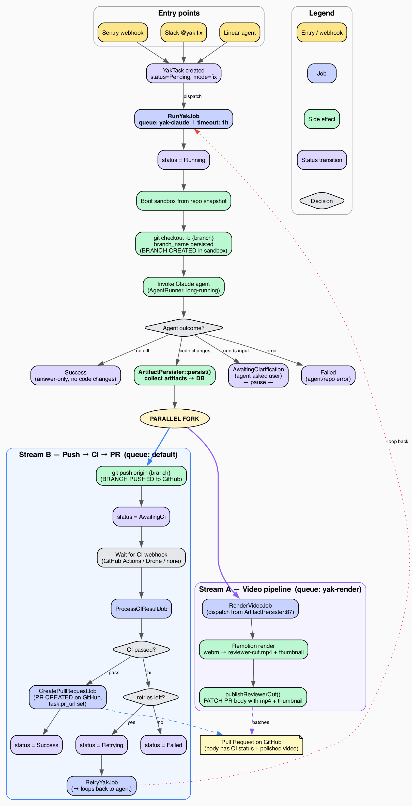

# Architecture

How Yak works under the hood. This page exists for the person who wants to understand the system before trusting it — or for someone debugging unexpected behavior who needs a mental model.

## The Core Loop

Every fix task goes through the same pipeline, regardless of where it came from:



After the agent finishes, work splits into two parallel streams:

- **Stream B (push → CI → PR)** pushes the branch, waits for CI, and on green creates the PR.
- **Stream A (video pipeline)** renders the polished Remotion walkthrough from the raw webm artifact and patches the PR body once the mp4 is ready.

Both streams converge on the same PR — whichever finishes first writes its piece, the other fills in later. Tasks never block the queue while CI runs: the worker finishes a job, CI runs asynchronously, and a webhook triggers the next step.

The diagram source is [`fix-task-flow.dot`](fix-task-flow.dot) (Graphviz). Regenerate with `dot -Tpng docs/fix-task-flow.dot -o docs/fix-task-flow.png -Gdpi=150`.

## Two-Tier AI

Yak uses two distinct AI layers with different models, different frameworks, and different responsibilities.

| Layer | Framework | Models | Purpose |
|---|---|---|---|
| **Routing & Analysis** | Laravel AI (Anthropic API) | Haiku, Sonnet | Webhook processing, request routing, communication with users in Slack/Linear, Sentry triage, task intake |
| **Implementation** | Claude Code CLI (`claude -p`) | Opus | Code changes, testing, committing, PR creation, research, ambiguity assessment |

### The Routing Layer

The routing layer is lightweight — classify the request, detect the repo, format the prompt, post results back to the source. It runs on the Anthropic API via Laravel AI using your `ANTHROPIC_API_KEY`.

| Task | Model | Why |
|---|---|---|
| Parse Slack message / webhook | Haiku | Fast, cheap, structured extraction |
| Detect repo from message | Haiku | Pattern matching against known slugs; falls back to natural-language routing using repo descriptions when no explicit mention is found (`RepoRoutingAgent`) |
| Summarize Sentry stacktrace | Sonnet | Needs actual code comprehension |
| Assemble task context from Linear/Sentry | Sonnet | Judgment about what context matters |
| Format and post results back to source | Haiku | Templated output |

### The Implementation Layer

Claude Code does the heavy lifting: reading files, assessing ambiguity with full codebase + MCP context, making changes, running tests, committing. It runs headlessly via `claude -p` with `--dangerously-skip-permissions` — no tool approval prompts, fully autonomous.

Claude Code is always Opus. Opus produces better first-attempt results, which means fewer retries and less total work than starting with Sonnet and escalating.

Implementation runs on a Claude Max subscription, not the API key. The subscription covers Claude Code usage; the API key covers the routing layer. These are **separate auth mechanisms** — see [Setup → Log In To Claude Code](setup.md#6-log-in-to-claude-code) for how each is configured.

## Channel Driver Architecture

Every external integration is a pluggable channel. Channels are enabled by the presence of credentials — no credentials, no channel. The app detects which channels are active at boot and registers only those routes, webhooks, and MCP servers.

```
┌─────────────────────────────────────────────────────┐
│                   Channel Drivers                    │
│                                                      │
│  Input Drivers (how tasks arrive):                   │
│  ┌────────┐ ┌────────┐ ┌────────┐ ┌──────────────┐  │
│  │ Slack  │ │ Linear │ │ Sentry │ │ Manual CLI   │  │
│  │  opt.  │ │  opt.  │ │  opt.  │ │ always avail │  │
│  └────────┘ └────────┘ └────────┘ └──────────────┘  │
│                                                      │
│  CI Drivers (how build results return):              │
│  ┌─────────────────┐ ┌────────┐                      │
│  │ GitHub Actions  │ │ Drone  │  (per-repo setting)  │
│  └─────────────────┘ └────────┘                      │
│                                                      │
│  Notification Drivers (where results are posted):    │
│  ┌────────┐ ┌────────┐ ┌────────┐                    │
│  │ Slack  │ │ Linear │ │ GitHub │  (follows source)  │
│  │  opt.  │ │  opt.  │ │  PRs   │                    │
│  └────────┘ └────────┘ └────────┘                    │
└─────────────────────────────────────────────────────┘
```

### The Three Driver Interfaces

Each channel implements one or more of these contracts, defined in `app/Contracts/`:

```php
InputDriver         // Parse incoming webhook/event → normalized task description
CIDriver            // Parse build result webhook → pass/fail with failure output
NotificationDriver  // Post status updates and results to the source
```

A single channel can fill multiple roles. GitHub is both a CI driver (via Actions) and a notification driver (via PR bodies). Slack is both an input driver and a notification driver.

### Routing Back To The Source

The rule is **respond where you were asked**. Every task has a `source` column identifying its origin. Notifications always route back to that source; if the source channel is disabled (for historical tasks after removing a channel), notifications fall back to a PR comment.

See the [Channels](channels.md) page for the full list of channels and their roles.

## The State Machine

Task status is a fat enum (`artisan-build/fat-enums`) with transitions enforced at the model level. Setting `$task->status = TaskStatus::AwaitingCi` on a task that is currently `Pending` throws `InvalidStateTransition` — the enum enforces the rules, not the job code.

### States

```
pending → running → awaiting_ci → success      (fix tasks)
pending → running → success                    (research / setup tasks)
```

With these branches:

- `running → awaiting_clarification → running` (Slack fix tasks only, 3-day TTL)
- `awaiting_ci → retrying → awaiting_ci` (at most one retry, so at most two attempts)
- `*→ failed` at any point where Claude errors, budget is exceeded, or retries run out

Three terminal states: `success`, `failed`, `expired`.

### Transition Diagram

```
                        ┌─────────────────────────────────────────┐
                        │           Fix Task (primary path)        │
                        │                                          │
pending ──→ running ────┼──→ awaiting_ci ──→ success               │
                │       │        │                                 │
                │       │        ├──→ retrying ──→ awaiting_ci     │
                │       │        │                    │            │
                │       │        └──→ failed ←────────┘            │
                │       │                                          │
                │       ├──→ awaiting_clarification ──→ running    │
                │       │        │                                 │
                │       │        └──→ expired                      │
                │       │                                          │
                │       └──→ failed                                │
                │                                                  │
                ├──→ success  (research / setup — no CI)           │
                │                                                  │
                └──→ failed   (error during any mode)              │
                        └─────────────────────────────────────────┘
```

### Full Transition Table

| From | To | Trigger |
|---|---|---|
| `Pending` | `Running` | Job picked up by queue worker |
| `Running` | `AwaitingCi` | Claude completed, branch pushed (mode = fix) |
| `Running` | `AwaitingClarification` | Claude returned clarification JSON (source = slack) |
| `Running` | `Success` | Research or setup task completed |
| `Running` | `Failed` | Claude errored, budget exceeded, scope exceeded |
| `AwaitingClarification` | `Running` | User replied in Slack thread, session resumed |
| `AwaitingClarification` | `Expired` | `clarification_expires_at` passed (3-day TTL) |
| `AwaitingCi` | `Success` | CI green, PR created |
| `AwaitingCi` | `Retrying` | CI red, `attempts < max_attempts` |
| `AwaitingCi` | `Failed` | CI red, `attempts >= max_attempts` |
| `Retrying` | `AwaitingCi` | Retry completed, branch force-pushed |
| `Retrying` | `Failed` | Claude errored on retry |

## Sandbox Isolation (Incus)

Every Claude Code task runs in an isolated **Incus system container**. Each container has its own Docker daemon, network namespace, and filesystem — cloned from a ZFS copy-on-write snapshot in under 3 seconds.

```
Host (Hetzner Dedicated Server)
│
├─ Yak App (Docker container)
│   ├─ Web (nginx + php-fpm)
│   ├─ Queue workers (4x yak-claude, 3x default)
│   └─ Scheduler
│
├─ MariaDB (Docker container, yak-internal network)
│
├─ Incus (system container manager, ZFS-backed)
│   ├─ yak-tpl-{repo}/ready  ← snapshot per repo (setup result)
│   │
│   ├─ task-42  ← clone of snapshot (CoW, isolated)
│   │   └─ Docker daemon, compose services, Claude Code
│   │
│   └─ task-43  ← another clone (fully independent)
│       └─ Docker daemon, compose services, Claude Code
```

### Why Incus

Three guarantees make sandboxed execution safe at scale:

- **Network isolation** — sandbox containers are on a separate bridge (`yak-sandbox`) with firewall rules blocking access to the yak app and MariaDB. The agent cannot reach the yak database, period.
- **Port isolation** — each container has its own network namespace. Port 8000 in container A doesn't conflict with port 8000 in container B.
- **Filesystem isolation** — ZFS copy-on-write means each container has its own writable filesystem. Changes in one container are invisible to others, so concurrent tasks on the same repo never collide.

### The Snapshot Workflow

1. **Setup** — `SetupYakJob` creates a sandbox from the base template (`yak-base`), clones the repo, runs Claude's setup (npm install, composer install, docker-compose up, etc.), then **snapshots the result** as `yak-tpl-{repo}/ready`.
2. **Task execution** — `RunYakJob` clones from the repo snapshot (instant, ~2s). The agent works in a pristine copy of the fully-prepared environment.
3. **Cleanup** — after the task completes (success or failure), the sandbox is destroyed. ZFS reclaims the space immediately.

### Docker-in-Incus

Repo dev environments using Docker Compose work natively inside Incus containers. `security.nesting=true` gives each container its own Docker daemon. There's no shared Docker socket, no port override files, no DinD hacks.

Private registry auth follows the same push-then-start pattern as Claude config and MCP config: Ansible renders `~/.docker/config.json` on the host from the `docker_registries` vault var, the Yak container bind-mounts it read-only, and `IncusSandboxManager` pushes the file into each fresh sandbox at `/home/yak/.docker/config.json` before `docker pull` ever runs. Repos that only need public images leave the vault var unset and the push is skipped entirely.

## Jobs and Queues

Two queues separate Claude Code work from everything else:

| Queue | Concurrency | Timeout | Jobs |
|---|---|---|---|
| `yak-claude` | 4 | 600s | RunYakJob, RetryYakJob, ResearchYakJob, SetupYakJob, ClarificationReplyJob |
| `default` | 3 | 30s | ProcessCIResultJob, webhook handlers, PR creation, notifications, cleanup |

The split exists to prevent a common failure mode: Task A's CI passes, but Task A's PR creation blocks for 10 minutes because Task B is mid-Opus on `yak-claude`. Putting coordination work (webhook processing, PR creation) on the `default` queue keeps it responsive even when Claude Code is busy.

### Concurrent Execution

With Incus sandbox isolation, Claude Code tasks run **concurrently** (4 workers by default). Each task gets its own isolated container — no shared ports, no shared filesystem, no shared Docker daemon. Throughput scales with available RAM (each sandbox uses ~4-8GB).

### The Main Jobs

- **`RunYakJob`** — the initial Claude Code session. Yak creates the branch (`yak/{external_id}`), then invokes Claude Code which writes code and commits locally. After Claude finishes, **Yak** pushes the branch and transitions the task to `awaiting_ci`. Claude Code never pushes or creates PRs — the system prompt explicitly forbids remote git operations.
- **`ClarificationReplyJob`** — runs when a user replies to a Slack clarification. Resumes the original Claude session with `--resume $session_id` and the user's chosen option. Claude already has full codebase context from the assessment phase — no ramp-up.
- **`ProcessCIResultJob`** — runs when a CI webhook arrives. On green, it collects artifacts and **Yak** creates the PR via the GitHub App API, then notifies the source. On red, it either dispatches `RetryYakJob` (first failure) or marks the task failed (second failure).
- **`RetryYakJob`** — resumes the original Claude session with CI failure output and runs a second attempt on the existing branch. **Yak** force-pushes the result.
- **`ResearchYakJob`** — for research mode tasks. Read-only; no branch, no CI. Claude generates a standalone HTML findings page saved to `.yak-artifacts/research.html`.
- **`SetupYakJob`** — the one-time dev environment setup task for a new repo. See [Repositories → The Setup Task](repositories.md#the-setup-task).
- **`RunYakReviewJob`** — the PR review path. Runs Claude in the sandbox with a read-only prompt scoped to a PR's diff, then posts the parsed findings as a GitHub review via the installation token. See [PR Review](pr-review.md).
- **`PollPullRequestReactionsJob`** — scheduled hourly. Polls GitHub for 👍/👎 reactions on Yak-authored review comments within a configurable window and denormalizes counts onto `pr_review_comments`.

### Middleware

- **`EnsureDailyBudget`** — checks the `daily_costs` table before Claude Code invocations. If today's routing-layer cost exceeds `daily_budget_usd`, the job fails gracefully. This prevents runaway alert storms from blowing the budget.

## Session Continuity

When a retry or clarification reply is needed, Yak uses `claude -p --resume $session_id` to continue the **original** Claude session. Claude retains its full context — files it read during assessment, approaches it considered, what it already tried.

This is the single biggest cost optimization in Yak. A fresh session starting from zero would re-read the codebase, re-check Sentry, re-analyze the stacktrace. Resuming skips all of that and jumps directly to the new prompt (the CI failure, or the user's chosen clarification option).

`session_id` is stored on the task row and used for:

- **Retries** after a first CI failure
- **Clarification replies** when a Slack user picks an option
- **Post-hoc debugging** — you can resume a completed task's session manually if needed

## The Data Model

Five tables, deliberately minimal. MariaDB is the backing store, running as a separate Docker container with its own persistent volume.

### `tasks`

The primary record. Every incoming event creates a task row. Key columns:

| Column | Purpose |
|---|---|
| `source` | `sentry`, `flaky-test`, `linear`, `slack`, `manual` |
| `repo` | Slug joining to `repositories.slug` |
| `external_id` | Source-side ID (GEO-1234, SENTRY-98765). Unique with `repo`. |
| `mode` | `fix`, `research`, `setup` |
| `status` | Fat enum: `pending`, `running`, `awaiting_clarification`, `awaiting_ci`, `retrying`, `success`, `failed`, `expired` |
| `branch_name` | `yak/{external_id}` once created |
| `session_id` | Claude session ID for `--resume` |
| `clarification_options` | JSON array of option strings (Slack only) |
| `pr_url`, `pr_merged_at`, `pr_closed_at` | Outcome tracking |
| `cost_usd`, `duration_ms`, `num_turns` | Metrics |

`UNIQUE(external_id, repo)` enforces deduplication — re-opening the same Sentry issue won't create a second task.

### `task_logs`

Append-only event log that powers the task detail page's timeline. Each row is `level` (info/warning/error) + `message` + optional JSON `metadata`. Events are written at key lifecycle points: task created, picked up, assessment complete, fix pushed, CI result, PR created, task completed.

### `artifacts`

Rows reference screenshots, videos, and research HTML pages stored on disk. Served at `/artifacts/{task}/{filename}` via signed URL (for PR embedding) or authenticated request (for dashboard viewing).

### `repositories`

One row per configured repo. Minimal schema — slug, name, path, default branch, CI system, Sentry mapping, setup status, notes. Everything else is auto-detected at task time from `README.md` and `CLAUDE.md`.

### `daily_costs`

Primary key is `date`. Tracks routing-layer API costs for budget enforcement. Updated after each task completes. Read by the `EnsureDailyBudget` middleware before any Claude Code invocation.

## Safety Model

The safety guarantees are deliberate design choices, not afterthoughts.

### `--dangerously-skip-permissions` Is Always On

Claude Code runs with `--dangerously-skip-permissions` on every invocation. No tool approval prompts, no human in the loop during execution. This is the only way unattended operation works at scale.

**The safety boundary is the sandbox**, not permission dialogs:

- **Dedicated server.** Completely separate from production. No VPN, no Tailscale, no shared network.
- **No production access.** No production databases, no customer data, no deployment pipelines.
- **Incus sandbox isolation.** Each task runs in its own Incus system container with:
  - **Own Docker daemon** — no access to the host's Docker socket.
  - **Own network namespace** — firewall rules block access to the yak app and MariaDB.
  - **Own filesystem** — ZFS copy-on-write from a snapshot. Changes are invisible to other tasks.
  - **Own process tree** — no visibility into host processes.
- **Short-lived credentials.** GitHub App tokens are injected per-task and are short-lived. Claude Max auth tokens are copied read-only from the host.
- **Automatic cleanup.** Sandbox containers are destroyed after each task. A cron job catches any that were missed.

Claude can do anything it wants inside that sandbox. The walls are real — Incus namespace isolation, not just user separation within a shared container.

### No Merge Authority

Yak creates PRs. Humans merge them. Always. The GitHub App should NOT be in your branch protection bypass list and should NOT have permission to approve reviews.

This is non-negotiable by design. If you want to automate merging, don't use Yak.

### Bounded Retries

At most two attempts per task. Retries use Opus (same model as the initial attempt). If two attempts both fail, the task is marked `failed` and a human takes over.

### Independent CI Verification

The full test suite runs on real CI, not on self-reported output from Claude. Claude runs *relevant* tests locally to catch obvious issues before pushing, but the authoritative check is CI.

### Cost Controls

Three layers:

- **Per-task budget** — `--max-budget-usd 5.00` on every Claude CLI invocation, as a runaway guardrail. Implementation cost is covered by the subscription; this limit exists for safety.
- **Daily budget** — `daily_budget_usd` (default $50) covers routing-layer API costs. Enforced by the `EnsureDailyBudget` middleware before any Claude Code job starts.
- **Deduplication** — `UNIQUE(external_id, repo)` prevents repeat work on the same issue.

### Scope Flag

PRs larger than `large_change_threshold` (default 200 LOC) get the `yak-large-change` label. Reviewers can use this to route reviews to more senior eyes or reject outright.

### Dashboard Auth

Google OAuth with a **required** domain allowlist (`GOOGLE_OAUTH_ALLOWED_DOMAINS`). There is no public dashboard. There are no roles — every team member behind the allowlist sees everything, including debug logs and session IDs, but nothing is reachable without signing in.

Artifacts embedded in GitHub PRs (screenshots, videos) use HMAC-SHA256 signed URLs with a 7-day expiry. After expiry, artifacts are still accessible through the authenticated dashboard.

## What Yak Is Not

- **Not a merge bot.** See above — no merge authority, no bypass.
- **Not horizontally scaled.** Four concurrent workers on one server. The architecture supports future scaling to multiple hosts but doesn't need it.
- **Not a long-running agent.** Every task is one-shot. No back-and-forth refinement. If a task needs iterative discussion, use a normal Claude session.
- **Not a frontend framework.** Dashboard is Livewire (server-rendered) with Livewire polling for live updates. No SPA, no websockets.
- **Not Kubernetes-anything.** Two Docker containers (app + MariaDB) + Incus for sandboxed task execution on a dedicated server. Laravel's database queue driver. Boring stack.
