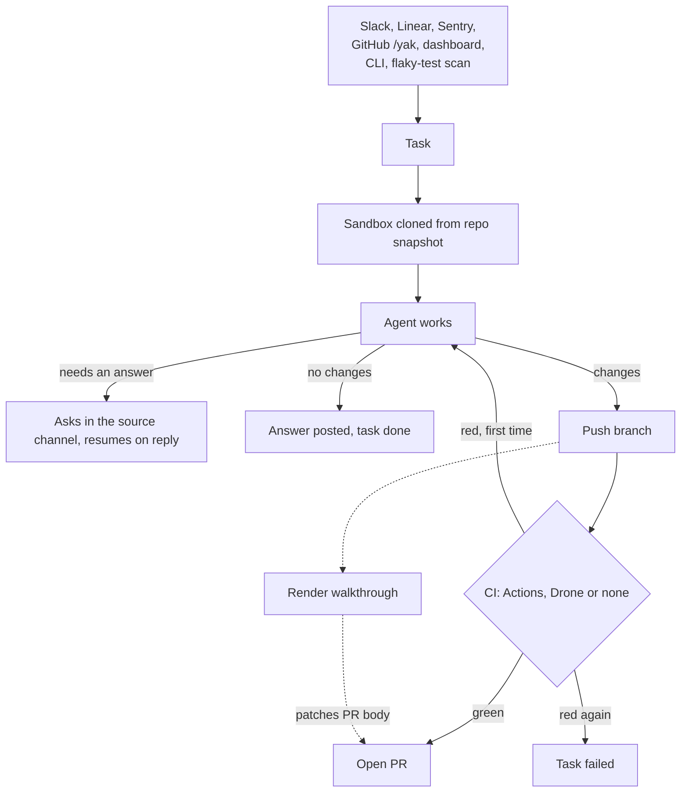

# Architecture

How Yak works under the hood, for someone who wants a mental model before trusting it or while debugging.

## Three workflows, one substrate

Yak drafts PRs for small fixes, reviews PRs line by line, and serves a preview for every branch. A human reviews and merges everything. The three workflows share one substrate: repos, the GitHub App, ingress and auth, Incus sandboxes with per-repo templates from `SetupYakJob`, jobs and queues, and the dashboard.

## Coding Agent Workflow

Every fix task goes through the same pipeline, regardless of where it came from:


```mermaid
flowchart TD
    A["Slack, Linear, Sentry,<br/>GitHub /yak, dashboard,<br/>CLI, flaky-test scan"] --> B["Task"]
    B --> C["Sandbox cloned from repo snapshot"]
    C --> D["Agent works"]
    D -->|"needs an answer"| Q["Asks in the source channel, resumes on reply"]
    D -->|"no changes"| E["Answer posted, task done"]
    D -->|"changes"| F["Push branch"]
    F --> G{"CI: Actions, Drone or none"}
    F -.-> W["Render walkthrough"]
    G -->|"green"| H["Open PR"]
    W -.->|"patches PR body"| H
    G -->|"red, first time"| D
    G -->|"red again"| X["Task failed"]
```

The push happens inside `RunYakJob`. The worker never waits for CI: a webhook (or the Drone poller) starts the next step. The walkthrough render runs in parallel and patches the PR body when it is ready.

### Walkthrough videos

The agent writes a `script.json` of shots and captions. In the sandbox, `yak-browser shoot` drives a real browser through it. Back in the app, `RenderWalkthroughJob` renders the cut, checks sampled frames and replaces the walkthrough section of the PR body. See [Video Walkthroughs](video-walkthroughs.md).

## Two-Tier AI

Yak uses two AI layers with different models and jobs.

### The Routing Layer

Routing is lightweight: classify the request, detect the repo, format the prompt, post results back to the source, and talk to users in Slack and Linear. It runs on the Anthropic API via Laravel AI using your `ANTHROPIC_API_KEY`. Haiku handles parsing and templated output. Sonnet handles work that needs code comprehension, like summarizing a Sentry stack trace.

### The Implementation Layer

Claude Code (`claude -p`, always Opus) does the heavy lifting: reading files, assessing ambiguity with full codebase and MCP context, making changes, running tests, committing. Opus gives better first attempts, so fewer retries than starting smaller and escalating.

Implementation runs on a Claude Max subscription, not the API key, which covers only the routing layer. See [Setup](setup.md#6-log-in-to-claude-code-on-the-server).

## Channels

Every integration is a pluggable channel, enabled by its credentials, that can take tasks in, report CI, or post notifications. Every task has a `source`, and notifications route back to it, or to a PR comment if that channel is now disabled. PR reviews and branch deployments talk to GitHub directly. See [Channels](channels.md) and [Development](development.md#adding-a-new-channel).

## Task State Machine

Task status is a fat enum (`artisan-build/fat-enums`) with transitions enforced at the model level. Setting `$task->status = TaskStatus::AwaitingCi` on a task that is currently `Pending` throws `InvalidStateTransition`. The enum enforces the rules, not the job code.


```mermaid
flowchart TB
    pending(["pending"]) --> running(["running"])
    running -->|"question asked"| clar(["awaiting_clarification"])
    clar -->|"reply"| running
    clar -->|"3-day TTL"| expired(["expired"])
    running -->|"fix pushed"| ci(["awaiting_ci"])
    running -->|"research, setup, no changes"| success(["success"])
    ci -->|"CI green, PR opened"| success
    ci -->|"CI red, first time"| retrying(["retrying"])
    retrying -->|"retry pushed"| ci
    ci -->|"CI red again"| failed(["failed"])
    failed -->|"Retry"| pending
    expired -->|"Retry"| pending
    expired ~~~ success
    retrying ~~~ failed
```

`success` and `cancelled` are final. Any active state can move to `failed` (Claude error, budget, retries out) or `cancelled`. A fix task gets at most one retry, so at most two attempts.

## Sandbox Isolation (Incus)

Every Claude Code task runs in an isolated **Incus system container**. Each container has its own Docker daemon, network namespace, and filesystem, cloned from a ZFS copy-on-write snapshot in under 3 seconds.

```
Host
├─ Yak app (Docker): web, queue workers (5 queues, see Jobs and Queues), scheduler
├─ MariaDB (Docker, yak-internal network)
└─ Incus (ZFS-backed)
   ├─ yak-tpl-{repo}/ready   snapshot per repo (setup result)
   ├─ task-42                CoW clone with its own Docker daemon
   └─ task-43                another clone, fully independent
```

### Why Incus

- **Network**: sandboxes sit on a separate bridge (`yak-sandbox`) with firewall rules blocking the Yak app and MariaDB. The agent cannot reach the Yak database.
- **Ports**: each container has its own network namespace, so port 8000 in two sandboxes never conflicts.
- **Filesystem**: ZFS copy-on-write gives each container its own writable filesystem, so concurrent tasks on one repo never collide.

### The Snapshot Workflow

1. **Setup**: `SetupYakJob` creates a sandbox from the base template (`yak-base`), clones the repo, runs Claude's setup (npm install, composer install, docker-compose up, etc.), then **snapshots the result** as `yak-tpl-{repo}/ready`.
2. **Task execution**: `RunYakJob` clones from the repo snapshot (instant, ~2s). The agent works in a pristine copy of the fully-prepared environment.
3. **Cleanup**: after the task completes (success or failure), the sandbox is destroyed. ZFS reclaims the space immediately.

Docker Compose repos work natively inside a sandbox: `security.nesting=true` gives each container its own Docker daemon. Private registry credentials are pushed in before `docker pull`. See [Setup](setup.md#private-docker-registries).

## Jobs and Queues

Five queues keep long agent runs from blocking everything else:

| Queue | Workers | Timeout | Jobs |
|---|---|---|---|
| `yak-claude` | 4 | 3600s | Agent runs: run, retry, research, setup, review, follow-up, clarification reply |
| `default` | 3 | 30s | ProcessCIResultJob, webhook handlers, PR creation, notifications, cleanup |
| `yak-render` | 1 | 900s | Walkthrough video and theme sample renders |
| `yak-deployments` | 2 | 900s | Branch deployment build, wake, hibernate, destroy |
| `yak-poll` | 1 | 600s | Polling GitHub review reactions |

Coordination work such as webhooks and PR creation stays on `default`, so it stays responsive while Claude Code is busy on `yak-claude`. Agent tasks run concurrently, each in its own sandbox, and throughput scales with RAM (about 4-8GB per sandbox).

Each agent job (`RunYakJob`, `RetryYakJob`, `ResearchYakJob`, `SetupYakJob`, `RunYakReviewJob`, `ClarificationReplyJob`) runs Claude Code in its own sandbox. Yak, not Claude, pushes the branch and creates the PR. `ProcessCIResultJob` handles CI results: on green it creates the PR, on the first red it dispatches a retry, and on the second it marks the task failed. See `app/Jobs/` for the full list.

## Session Continuity

For a retry or clarification reply, Yak runs `claude -p --resume $session_id` to continue the **original** session. Claude keeps the files it read and what it already tried, so it skips re-reading the codebase. This is the biggest cost saving in Yak. `session_id` is stored on the task row and is used for retries after a CI failure and for clarification replies. You can also resume a finished task's session by hand when debugging.

## PR Review and Branch Deployments

PR review runs in a sandbox fork of the same per-repo template, with its own state machine, and posts native GitHub review comments. See [PR Review](pr-review.md).

Every open PR on an opted-in repo gets a preview in its own Incus container from the same template snapshot. Caddy handles wildcard TLS and OAuth forward-auth. Previews hibernate after 15 idle minutes and are destroyed when the PR closes. See [Branch Deployments](branch-deployments.md).

## Safety Model

### `--dangerously-skip-permissions` Is Always On

Claude Code runs with `--dangerously-skip-permissions` on every invocation. No tool approval prompts during execution. A human reviews the resulting PR.

**The safety boundary is the sandbox**, not permission dialogs:

- **Dedicated server.** Separate from production, with no VPN and no shared network. No production databases, customer data or deployment pipelines.
- **Incus sandbox isolation.** See [Sandbox Isolation](#sandbox-isolation-incus).
- **Short-lived credentials.** GitHub App tokens are injected per-task and are short-lived. Claude Max auth tokens are copied read-only from the host.
- **Automatic cleanup.** Sandbox containers are destroyed after each task. A cron job catches any that were missed.

### No Merge Authority

Yak creates PRs. Humans merge them. Always. The GitHub App must NOT be in your branch protection bypass list. Repository owners may opt into risk-based review approval (see [Risk-Based Approval](risk-based-approval.md)); this grants no merge authority.

### Other Guardrails

- **Bounded retries**: at most two attempts per task, both on Opus. After two failures the task is `failed` and a human takes over.
- **Independent CI**: the authoritative check is real CI, not Claude's self-reported output. Claude only runs relevant tests locally.
- **Scope flag**: PRs over `large_change_threshold` (default 200 LOC) get the `yak-large-change` label, so reviewers can route them to more senior eyes.

### Cost Controls

- **Per-task budget**: `--max-budget-usd 5.00` on every Claude CLI invocation, as a runaway guardrail. Implementation cost is covered by the subscription; this limit exists for safety.
- **Daily budget**: `daily_budget_usd` (default $50, set with `YAK_DAILY_BUDGET_USD`) counts the reported cost of routing calls and every agent run. On a Max subscription that cost is notional, so raise it to match your volume. The `EnsureDailyBudget` middleware fails a job before it starts once the day's total is over the limit.
- **Deduplication**: tasks are unique on `external_id` plus `repo`, so re-opening the same Sentry issue does not create a second task.

### Dashboard Auth

Google OAuth with a **required** domain allowlist (`GOOGLE_OAUTH_ALLOWED_DOMAINS`). There is no public dashboard and there are no roles: everyone behind the allowlist sees everything, including debug logs and session IDs. Artifacts embedded in PRs use HMAC-SHA256 signed URLs with a 7-day expiry, then stay available through the dashboard.

## What Yak Is Not

- **Not a merge bot.** No merge authority, no bypass.
- **Not horizontally scaled.** One server, four concurrent agent workers.
- **Not an interactive agent.** Each task is a focused pass with follow-ups on the same branch, not a chat session for large multi-step features.
- **Not a production deploy platform.** Previews are preview environments only. Merging a PR does not deploy it anywhere.
