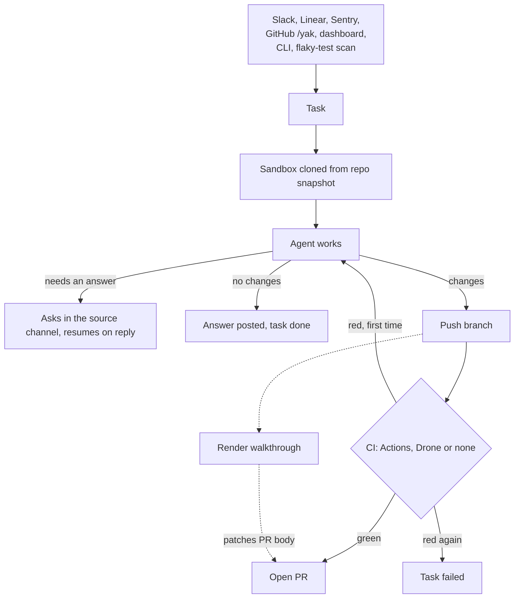
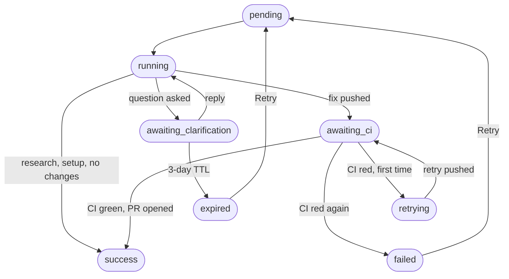

# Architecture

How Yak works under the hood. This page exists for the person who wants to understand the system before trusting it — or for someone debugging unexpected behavior who needs a mental model.

## Three workflows, one substrate

Yak is a coding agent that drafts PRs for small fixes, reviews PRs line by line, and serves a preview for every branch. A human reviews and merges everything. One shared sandbox fleet powers all three workflows.

```
              ┌────────────────────────────────────────────┐
              │              Workflows (surfaces)          │
              │                                            │
              │  Coding Agent    PR Review    Branch       │
              │  (papercuts)     (line-level  Deployments  │
              │                   comments)                │
              └────────────────────────────────────────────┘
                                 │
              ┌────────────────────────────────────────────┐
              │              Substrate (shared)            │
              │                                            │
              │  Repos ⟷ GitHub App ⟷ Ingress ⟷ Auth       │
              │  Sandboxes (Incus + ZFS CoW + per-repo     │
              │  templates from SetupYakJob)               │
              │  Jobs / Queues / Scheduler                 │
              │  Dashboard / Artifacts / Logs / Costs      │
              └────────────────────────────────────────────┘
```

The substrate is what everything shares. Workflows are the user-facing surfaces. New workflows in the future plug into the same substrate without reshaping the base.

## Coding Agent Workflow

Every fix task goes through the same pipeline, regardless of where it came from:


```mermaid
flowchart TD
    A["Slack, Linear, Sentry,<br/>GitHub /yak, dashboard,<br/>CLI, flaky-test scan"] --> B["Task"]
    B --> C["Sandbox cloned from repo snapshot"]
    C --> D["Agent works"]
    D -->|"needs an answer"| Q["Asks in the source channel, resumes on reply"]
    D -->|"no changes"| E["Answer posted, task done"]
    D -->|"changes"| F["Push branch"]
    F --> G{"CI: Actions, Drone or none"}
    F -.-> W["Render walkthrough"]
    G -->|"green"| H["Open PR"]
    W -.->|"patches PR body"| H
    G -->|"red, first time"| D
    G -->|"red again"| X["Task failed"]
```

The push happens inside `RunYakJob`. The worker never waits for CI: a webhook (or the Drone poller) starts the next step. The walkthrough render runs in parallel and patches the PR body when it is ready.

### The Walkthrough Video Pipeline (v3)

The agent writes a `script.json` describing the walkthrough as a sequence of shots and captions. Inside the sandbox, `yak-browser script` lints it and `yak-browser shoot` drives a real browser through it, producing clips, stills and a manifest. Back in the app, one `RenderWalkthroughJob` per task turns those into a rendered cut, checks sampled frames for blank or garbled output, and replaces the walkthrough section of the PR body. See [Video Walkthroughs](video-walkthroughs.md) for the operator view.

## Two-Tier AI

Yak uses two distinct AI layers with different models, different frameworks, and different responsibilities.

| Layer | Framework | Models | Purpose |
|---|---|---|---|
| **Routing & Analysis** | Laravel AI (Anthropic API) | Haiku, Sonnet | Webhook processing, request routing, communication with users in Slack/Linear, Sentry triage, task intake |
| **Implementation** | Claude Code CLI (`claude -p`) | Opus | Code changes, testing, committing, PR creation, research, ambiguity assessment |

### The Routing Layer

The routing layer is lightweight — classify the request, detect the repo, format the prompt, post results back to the source. It runs on the Anthropic API via Laravel AI using your `ANTHROPIC_API_KEY`.

| Task | Model | Why |
|---|---|---|
| Parse Slack message / webhook | Haiku | Fast, cheap, structured extraction |
| Detect repo from message | Haiku | Pattern matching against known slugs; falls back to natural-language routing using repo descriptions when no explicit mention is found (`RepoRoutingAgent`) |
| Summarize Sentry stacktrace | Sonnet | Needs actual code comprehension |
| Assemble task context from Linear/Sentry | Sonnet | Judgment about what context matters |
| Format and post results back to source | Haiku | Templated output |

### The Implementation Layer

Claude Code does the heavy lifting: reading files, assessing ambiguity with full codebase + MCP context, making changes, running tests, committing. It runs headlessly via `claude -p` with `--dangerously-skip-permissions` — no tool approval prompts inside the sandbox.

Claude Code is always Opus. Opus produces better first-attempt results, which means fewer retries and less total work than starting with Sonnet and escalating.

Implementation runs on a Claude Max subscription, not the API key. The subscription covers Claude Code usage; the API key covers the routing layer. These are **separate auth mechanisms** — see [Setup → Log In To Claude Code](setup.md#6-log-in-to-claude-code-on-the-server) for how each is configured.

## Channels

Every external integration is a pluggable channel, enabled by the presence of its credentials. A channel can fill three roles: input (how tasks arrive), CI (how build results return) and notification (where results are posted). The rule is to respond where you were asked. Every task has a `source`, and notifications route back to it. If that channel has since been disabled, they fall back to a PR comment.

PR reviews and branch deployments talk to GitHub directly and do not use the channel interfaces. See [Channels](channels.md) for the roles of each channel and [Development](development.md#adding-a-new-channel) for the code layout.

## Task State Machine

Task status is a fat enum (`artisan-build/fat-enums`) with transitions enforced at the model level. Setting `$task->status = TaskStatus::AwaitingCi` on a task that is currently `Pending` throws `InvalidStateTransition` — the enum enforces the rules, not the job code.


```mermaid
flowchart TB
    pending(["pending"]) --> running(["running"])
    running -->|"question asked"| clar(["awaiting_clarification"])
    clar -->|"reply"| running
    clar -->|"3-day TTL"| expired(["expired"])
    running -->|"fix pushed"| ci(["awaiting_ci"])
    running -->|"research, setup, no changes"| success(["success"])
    ci -->|"CI green, PR opened"| success
    ci -->|"CI red, first time"| retrying(["retrying"])
    retrying -->|"retry pushed"| ci
    ci -->|"CI red again"| failed(["failed"])
    failed -->|"Retry"| pending
    expired -->|"Retry"| pending
    expired ~~~ success
    retrying ~~~ failed
```

`success` and `cancelled` are final. Any active state can move to `failed` (Claude error, budget, retries out) or `cancelled`. A fix task gets at most one retry, so at most two attempts.

### Full Transition Table

| From | To | Trigger |
|---|---|---|
| `Pending` | `Running` | Job picked up by queue worker |
| `Running` | `AwaitingCi` | Claude completed, branch pushed (mode = fix) |
| `Running` | `AwaitingClarification` | Claude returned clarification JSON |
| `Running` | `Success` | Research or setup task completed |
| `Running` | `Failed` | Claude errored, budget exceeded, scope exceeded |
| `AwaitingClarification` | `Running` | User replied in the source channel, session resumed |
| `AwaitingClarification` | `Expired` | `clarification_expires_at` passed (3-day TTL) |
| `AwaitingCi` | `Success` | CI green, PR created |
| `AwaitingCi` | `Retrying` | CI red, `attempts < max_attempts` |
| `AwaitingCi` | `Failed` | CI red, `attempts >= max_attempts` |
| `Retrying` | `AwaitingCi` | Retry completed, branch force-pushed |
| `Retrying` | `Failed` | Claude errored on retry |

## Sandbox Isolation (Incus)

Every Claude Code task runs in an isolated **Incus system container**. Each container has its own Docker daemon, network namespace, and filesystem — cloned from a ZFS copy-on-write snapshot in under 3 seconds.

```
Host (Hetzner Dedicated Server)
│
├─ Yak App (Docker container)
│   ├─ Web (nginx + php-fpm)
│   ├─ Queue workers (4x yak-claude, 3x default)
│   └─ Scheduler
│
├─ MariaDB (Docker container, yak-internal network)
│
├─ Incus (system container manager, ZFS-backed)
│   ├─ yak-tpl-{repo}/ready  ← snapshot per repo (setup result)
│   │
│   ├─ task-42  ← clone of snapshot (CoW, isolated)
│   │   └─ Docker daemon, compose services, Claude Code
│   │
│   └─ task-43  ← another clone (fully independent)
│       └─ Docker daemon, compose services, Claude Code
```

### Why Incus

Three guarantees make sandboxed execution safe at scale:

- **Network isolation** — sandbox containers are on a separate bridge (`yak-sandbox`) with firewall rules blocking access to the yak app and MariaDB. The agent cannot reach the yak database, period.
- **Port isolation** — each container has its own network namespace. Port 8000 in container A doesn't conflict with port 8000 in container B.
- **Filesystem isolation** — ZFS copy-on-write means each container has its own writable filesystem. Changes in one container are invisible to others, so concurrent tasks on the same repo never collide.

### The Snapshot Workflow

1. **Setup** — `SetupYakJob` creates a sandbox from the base template (`yak-base`), clones the repo, runs Claude's setup (npm install, composer install, docker-compose up, etc.), then **snapshots the result** as `yak-tpl-{repo}/ready`.
2. **Task execution** — `RunYakJob` clones from the repo snapshot (instant, ~2s). The agent works in a pristine copy of the fully-prepared environment.
3. **Cleanup** — after the task completes (success or failure), the sandbox is destroyed. ZFS reclaims the space immediately.

### Docker-in-Incus

Repo dev environments using Docker Compose work natively inside Incus containers. `security.nesting=true` gives each container its own Docker daemon. There's no shared Docker socket, no port override files, no DinD hacks.

Private registry credentials are pushed into each sandbox before `docker pull` runs. See [Setup → Private Docker Registries](setup.md#private-docker-registries).

## Jobs and Queues

Five queues keep long agent runs from blocking everything else:

| Queue | Workers | Timeout | Jobs |
|---|---|---|---|
| `yak-claude` | 4 | 3600s | Agent runs: run, retry, research, setup, review, follow-up, clarification reply |
| `default` | 3 | 30s | ProcessCIResultJob, webhook handlers, PR creation, notifications, cleanup |
| `yak-render` | 1 | 900s | Walkthrough video and theme sample renders |
| `yak-deployments` | 2 | 900s | Branch deployment build, wake, hibernate, destroy |
| `yak-poll` | 1 | 600s | Polling GitHub review reactions |

The split exists to prevent a common failure mode: Task A's CI passes, but Task A's PR creation blocks for 10 minutes because Task B is mid-Opus on `yak-claude`. Putting coordination work (webhook processing, PR creation) on the `default` queue keeps it responsive even when Claude Code is busy.

### Concurrent Execution

With Incus sandbox isolation, Claude Code tasks run **concurrently** (4 workers by default). Each task gets its own isolated container — no shared ports, no shared filesystem, no shared Docker daemon. Throughput scales with available RAM (each sandbox uses ~4-8GB).

### The Main Jobs

Each agent job (`RunYakJob`, `RetryYakJob`, `ResearchYakJob`, `SetupYakJob`, `RunYakReviewJob`, `ClarificationReplyJob`) runs Claude Code in its own sandbox. Yak, not Claude, pushes the branch and creates the PR. Claude never runs remote git operations. `ProcessCIResultJob` handles CI results: on green it creates the PR, on the first red it dispatches a retry, and on the second it marks the task failed. `RenderWalkthroughJob` produces the video. See `app/Jobs/` for the full list.

### Middleware

- **`EnsureDailyBudget`** — checks the `daily_costs` table before Claude Code invocations. If today's total cost exceeds `daily_budget_usd`, the job fails gracefully. This prevents runaway alert storms from blowing the budget.

## Session Continuity

When a retry or clarification reply is needed, Yak uses `claude -p --resume $session_id` to continue the **original** Claude session. Claude retains its full context — files it read during assessment, approaches it considered, what it already tried.

This is the single biggest cost optimization in Yak. A fresh session starting from zero would re-read the codebase, re-check Sentry, re-analyze the stacktrace. Resuming skips all of that and jumps directly to the new prompt (the CI failure, or the user's chosen clarification option).

`session_id` is stored on the task row and used for:

- **Retries** after a first CI failure
- **Clarification replies** when a Slack user picks an option
- **Post-hoc debugging** — you can resume a completed task's session manually if needed

## Deduplication

Tasks are unique on `external_id` plus `repo`, so re-opening the same Sentry issue does not create a second task. Each task's `session_id` is stored for `--resume`, and `task_logs` powers the timeline on the task page.

## PR Review Workflow

Yak reviews pull requests in a dedicated workflow that runs alongside the coding agent. The review agent runs in a sandbox fork of the same per-repo template, reads the PR diff, and leaves line-level comments (`suggestion` blocks where the fix is obvious, prose when it needs explanation).

The review workflow reuses the substrate: same GitHub App, same sandbox infrastructure, same dashboard surface. It has its own state machine separate from the task state machine. Reviewer output is surfaced as native GitHub PR review comments.

For the full flow, see [PR Review](pr-review.md).

## Branch Deployments Workflow

Every open PR on an opted-in repo gets a live preview URL at `<repo>-<branch>.<hostname>`, wired up automatically from the `pull_request.opened` webhook. Previews are:

- OAuth-gated by default, with optional time-boxed public-share tokens for external reviewers
- Hibernated when idle after 15 minutes, resumed on the next request (first-hit latency 5 to 15 seconds)
- Destroyed when the PR closes, merges, or is deleted, or after 30 days of inactivity

Each preview runs in its own Incus container cloned from the same per-repo template snapshot that powers task sandboxes. A reverse proxy (Caddy in the default install) handles wildcard TLS, OAuth enforcement via forward-auth, and upstream resolution per request.

Preview state is mirrored to GitHub's native Deployments API, so the PR UI shows a "View deployment" button automatically.

For the end-to-end user guide, see [Branch Deployments](branch-deployments.md).

## Safety Model

The safety guarantees are deliberate design choices, not afterthoughts.

### `--dangerously-skip-permissions` Is Always On

Claude Code runs with `--dangerously-skip-permissions` on every invocation. No tool approval prompts during execution. A human reviews the resulting PR.

**The safety boundary is the sandbox**, not permission dialogs:

- **Dedicated server.** Completely separate from production. No VPN, no Tailscale, no shared network.
- **No production access.** No production databases, no customer data, no deployment pipelines.
- **Incus sandbox isolation.** Each task runs in its own system container with its own Docker daemon, network namespace, filesystem and process tree. See [Sandbox Isolation](#sandbox-isolation-incus).
- **Short-lived credentials.** GitHub App tokens are injected per-task and are short-lived. Claude Max auth tokens are copied read-only from the host.
- **Automatic cleanup.** Sandbox containers are destroyed after each task. A cron job catches any that were missed.

Claude can do anything it wants inside that sandbox. The walls are real — Incus namespace isolation, not just user separation within a shared container.

### No Merge Authority

Yak creates PRs. Humans merge them. Always. The GitHub App must NOT be in your branch protection bypass list. Repository owners may opt into risk-based review approval (see [Risk-Based Approval](risk-based-approval.md)); this grants no merge authority.

This is non-negotiable by design. If you want to automate merging, don't use Yak.

### Bounded Retries

At most two attempts per task. Retries use Opus (same model as the initial attempt). If two attempts both fail, the task is marked `failed` and a human takes over.

### Independent CI Verification

The full test suite runs on real CI, not on self-reported output from Claude. Claude runs *relevant* tests locally to catch obvious issues before pushing, but the authoritative check is CI.

### Cost Controls

Three layers:

- **Per-task budget** — `--max-budget-usd 5.00` on every Claude CLI invocation, as a runaway guardrail. Implementation cost is covered by the subscription; this limit exists for safety.
- **Daily budget** — `daily_budget_usd` (default $50, set with `YAK_DAILY_BUDGET_USD`) counts the reported cost of routing calls and every agent run. On a Max subscription that cost is notional, so raise it to match your volume. Enforced by the `EnsureDailyBudget` middleware before any Claude Code job starts.
- **Deduplication** — `UNIQUE(external_id, repo)` prevents repeat work on the same issue.

### Scope Flag

PRs larger than `large_change_threshold` (default 200 LOC) get the `yak-large-change` label. Reviewers can use this to route reviews to more senior eyes or reject outright.

### Dashboard Auth

Google OAuth with a **required** domain allowlist (`GOOGLE_OAUTH_ALLOWED_DOMAINS`). There is no public dashboard. There are no roles — every team member behind the allowlist sees everything, including debug logs and session IDs, but nothing is reachable without signing in.

Artifacts embedded in GitHub PRs (screenshots, videos) use HMAC-SHA256 signed URLs with a 7-day expiry. After expiry, artifacts are still accessible through the authenticated dashboard.

## What Yak Is Not

- **Not a merge bot.** See above — no merge authority, no bypass.
- **Not horizontally scaled.** Four concurrent workers on one server. The architecture supports future scaling to multiple hosts but doesn't need it.
- **Not a long-running interactive agent.** Each task is a focused pass. You can give feedback on an open PR — in the originating channel, as a `/yak` PR comment, or from the dashboard — and Yak resumes the session and pushes follow-up commits to the same branch. But it's not a chat session for open-ended discussion or large multi-step features.
- **Not a frontend framework.** Dashboard is Inertia + React on `@geocodio/console-ui`, with polling for live updates. No websockets.
- **Not Kubernetes-anything.** Two Docker containers (app + MariaDB) + Incus for sandboxed task execution on a dedicated server. Laravel's database queue driver. Boring stack.
- **Not a production deploy platform.** Previews are preview environments only. Merging a PR does not deploy it anywhere; the existing production deploy pipeline remains the source of truth.
