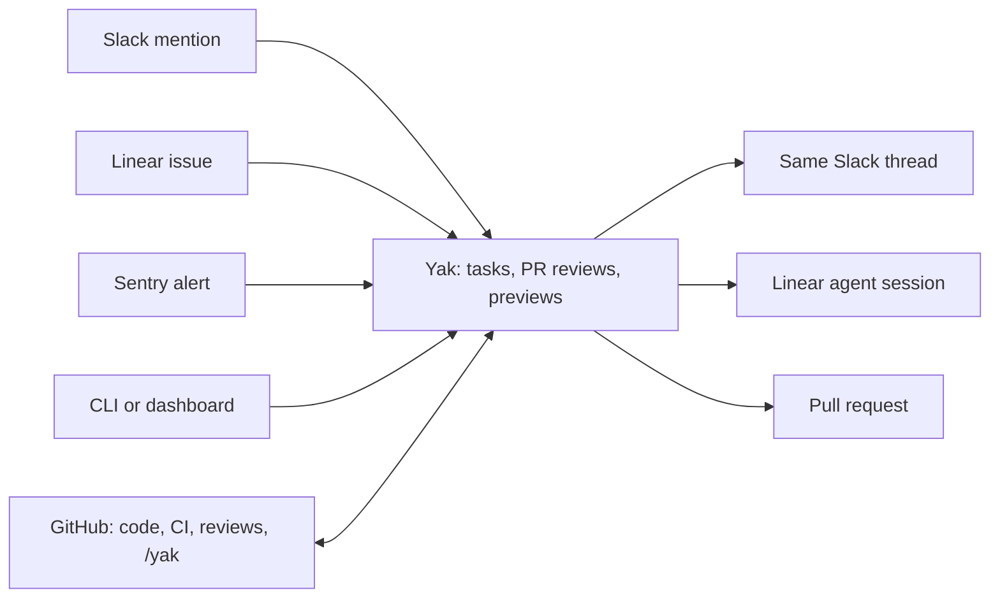

# How Yak works

Yak is a coding agent that drafts PRs for small fixes, reviews PRs line by line, and serves a preview for every branch. A human reviews and merges everything.

## The channel map

Yak answers where you asked. GitHub is required. The CLI and dashboard are always on. Slack, Linear, Sentry and Drone are optional. See [Channels](channels.md).

## What a task is

A task is one unit of work for one repo, a paragraph or less: a bug fix, a flaky test, a lint cleanup. Yak clones a sandbox from the repo snapshot, runs the agent, pushes a branch, waits for CI and opens a PR. If the request is unclear, Yak asks a question in the channel it came from. Reply there, or comment `/yak` on the PR, to refine the work. The full pipeline and the task states are in [Architecture](architecture.md#coding-agent-workflow).

## What Yak does and does not do

- Yak opens PRs for human review. It never merges, deploys to production or ships release artifacts.
- Yak reviews PRs with line-level comments. See [PR Review](pr-review.md).
- Yak serves a preview URL for every open PR on an opted-in repo. Previews are not production. See [Branch Deployments](branch-deployments.md).
- Yak does the first pass on small, focused work. It is not a chat session for large multi-step features.

## Dashboard tour

| Page | What it is for |
|---|---|
| Tasks | Every task with its status, logs and PR. Create, retry or cancel a task here. |
| Observations | Things Yak looked at and whether it acted or took no action. |
| Repositories | Add repos, run setup, set per-repo options. See [Repositories](repositories.md). |
| Deployments | Preview environments, their activity log and share links. |
| PR Reviews | Review feedback and reactions. See [PR Review](pr-review.md). |
| Prompts | Edit the prompts Yak sends. See [Prompting](prompting.md). |
| Costs and Analytics | Spend against the daily budget, and task trends. |
| Skills | Install Claude Code plugins and skills the agent can use. |
| MCP servers | Add MCP servers for the agent. See [Prompting](prompting.md#mcp-servers). |
| Health | Status checks for the server and its channels. |
| Channels and Settings | Channel status, profile and installation settings. |
